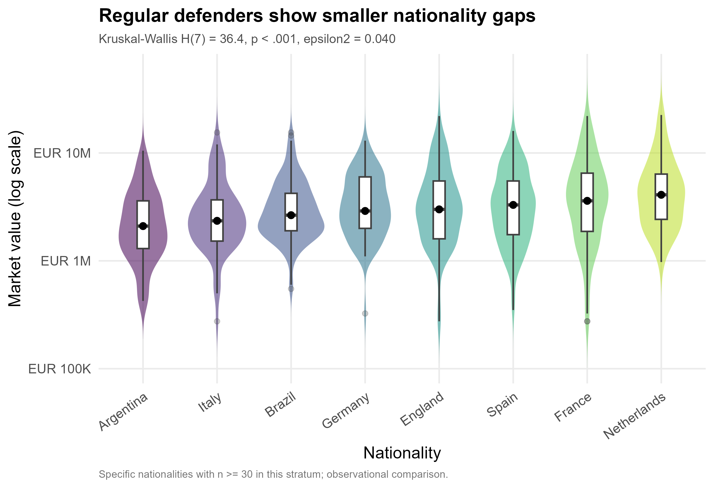

# Analysis: FIFA 23 Nationality and Player Value

## TL;DR
- After excluding 98 zero-value players, the analysis sample contains 17,426 FIFA 23 players from 157 nationalities.
- Market value is extremely right-skewed, so all value comparisons use log scale, medians, nonparametric tests, or Gamma GLM with a log link.
- Among regular midfielders, nationality differences are weak: Kruskal-Wallis p = 0.122, epsilon2 = 0.006.
- Among regular defenders, nationality differences are statistically clearer but still small: p < .001, epsilon2 = 0.040.
- Development midfielders show much larger observed gaps by specific nationality: p < .001, epsilon2 = 0.252.
- In Gamma models controlling age, overall, and potential, nationality coefficients are mostly modest; ability and potential remain stronger value predictors than nationality labels.

## Data
- Source file: `data/FIFA 23 Players.csv`, described in `data/FIFA/README.md`.
- Raw data: n = 17,524, columns = 89. Analysis data: n = 17,426 after removing players with `Value(in Euro) <= 0`.
- There were no missing market values and no duplicated `Full Name` entries in this file. The main quality issue was the 98 zero-value rows, which cannot be used in log-value or Gamma value models.
- Position was collapsed only into four football role groups: Forward, Midfielder, Defender, Goalkeeper. Nationality was not collapsed into broad regions; specific nationalities were compared only when a stratum had enough observations.

## EDA
- Value has a long right tail. The median value in the analysis sample is EUR 1.00M, far below the maximum superstar values.
- The most poster-useful homogeneous regular-tier groups were regular midfielders and regular defenders. They have enough observations across multiple specific nationalities while avoiding an over-broad all-player comparison.
- In raw medians, the highest regular-midfielder nationality in the selected set was England: median EUR 4.20M (n=86); the highest regular-defender nationality was Netherlands: median EUR 4.10M (n=42). These are descriptive comparisons, not adjusted effects.

## Main Analysis
- Because log market value was not consistently normal within nationality groups, and Levene tests showed unequal variances for regular defenders and development midfielders, the group comparison uses Kruskal-Wallis tests instead of ANOVA.
- Regular midfielders: H(7) = 11.4, p = 0.122, epsilon2 = 0.006. This is a very small observed nationality association in this stratum.
- Regular defenders: H(7) = 36.4, p < .001, epsilon2 = 0.040. The pattern is statistically clearer, but the effect size is still small.
- Development midfielders: H(7) = 463.4, p < .001, epsilon2 = 0.252. In this lower tier, specific nationality differences are much larger.

## Regression Results
- I fitted Gamma GLMs with log link within each selected stratum: `value_eur ~ nationality + overall + potential + age`.
- For regular midfielders, the model baseline nationality was Spain (largest group in the selected stratum). Brazil was estimated at -5.5% [95% CI -8.9%, -1.9%] relative to Spain after controls; most other nationality CIs overlapped zero percent difference.
- For regular defenders, the model baseline nationality was Brazil. Spain was estimated at 7.8% [95% CI 3.3%, 12.4%] and England at 4.6% [95% CI 0.0%, 9.3%] relative to Brazil after controls.
- These regression coefficients are adjusted associations in this sample. They should not be written as causal nationality effects.

## Diagnostics & Robustness
- Required assumption checks were run before group testing. Levene p-values were: regular midfielders = 0.965, regular defenders = 0.014, development midfielders < .001. This supports using nonparametric tests for the unequal-variance strata.
- Every `glm()` produced a `performance::check_model()` diagnostic figure:
  - `figs/fig_diag_gamma_regular_midfielders.png`
  - `figs/fig_diag_gamma_regular_defenders.png`
  - `figs/fig_diag_gamma_development_midfielders.png`
- Collinearity was acceptable but not zero. The highest VIFs were 4.74 for regular midfielders, 4.00 for regular defenders, and 3.75 for development midfielders, all on `potential_c`.
- Robustness note: development midfielders show much stronger nationality gaps than regular-tier players, so poster claims should specify the stratum. A single all-player statement would hide this heterogeneity.

## Conclusions
- In this FIFA 23 sample, specific nationality is associated with player market value within some position-rating strata, but the size of the association depends strongly on the stratum.
- For regular-tier players, nationality gaps are small compared with ability and potential variables. Defender comparisons show clearer differences than midfielder comparisons.
- The clearest poster finding is not that nationality universally predicts value; it is that observed nationality gaps are concentrated in some strata, especially development midfielders, while regular-tier gaps are modest.

Limitations: This is cross-sectional observational data. The analysis reports associations, not causal effects. Unobserved variables such as league, contract context, club bargaining power, injury history, and scouting visibility may partly explain the observed nationality patterns.

## Notes for the Team
- I followed the project rule against over-coarse nationality grouping: the analysis compares specific nationalities and uses an n >= 30 threshold within each stratum.
- The README suggests ANOVA as a possible route, but assumption checks did not support plain ANOVA for all target strata; I used Kruskal-Wallis tests and Gamma log-link GLMs instead.
- Figure captions and titles avoid causal language. For the poster, use wording like "is associated with" or "observed gap", not "nationality causes value differences".
- The strongest Development-midfielder pattern may be partly a league/club-market artifact. Treat it as a hypothesis-generating descriptive result unless more controls are added.
