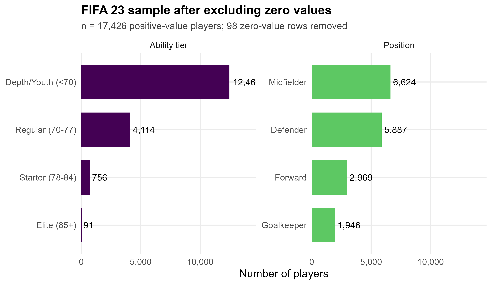
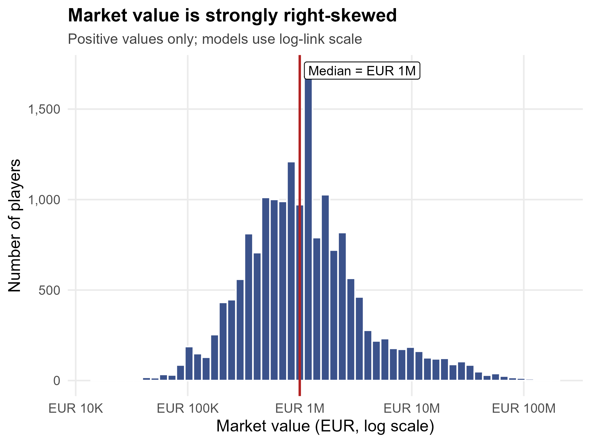
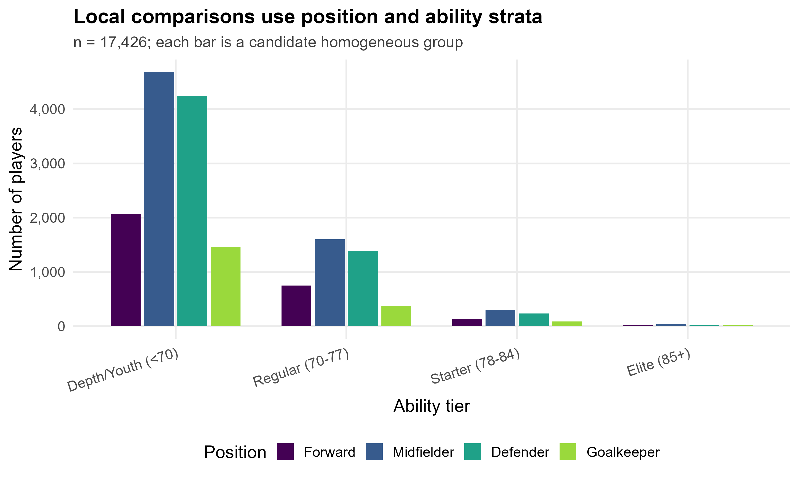
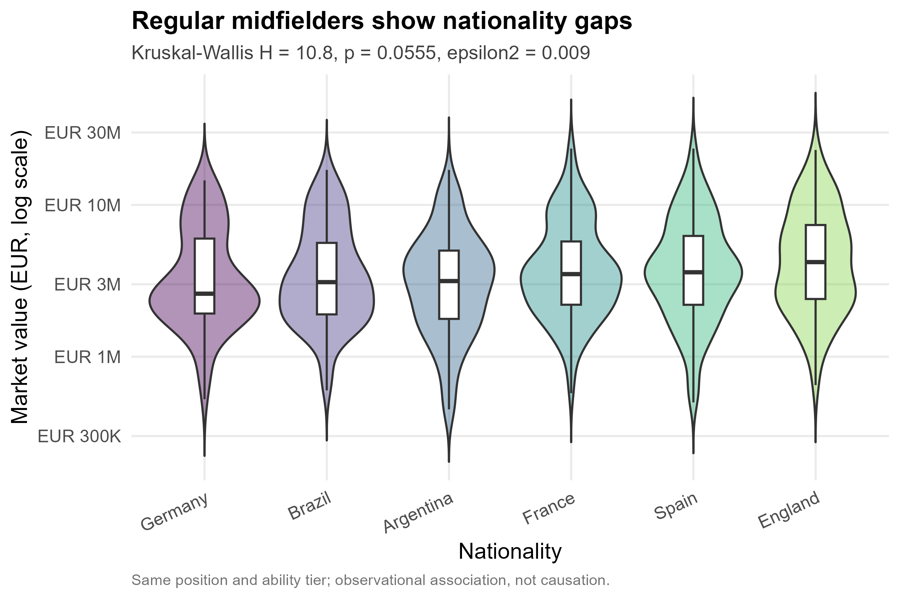
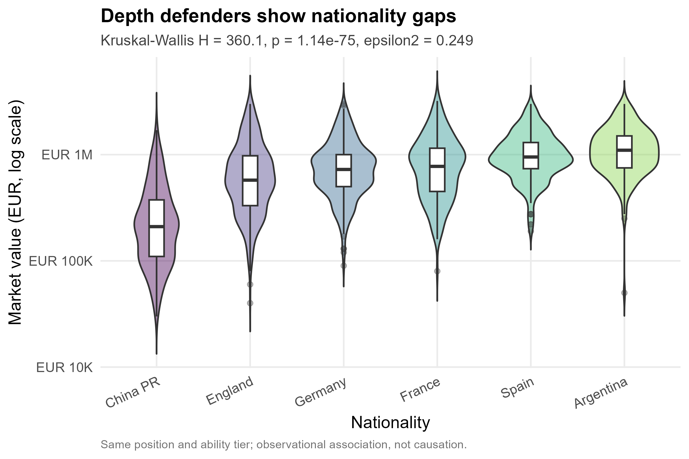
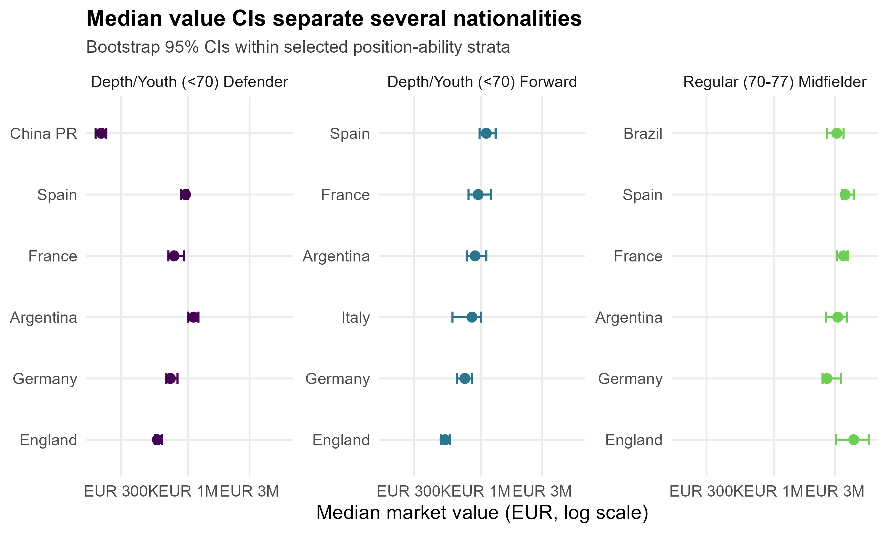
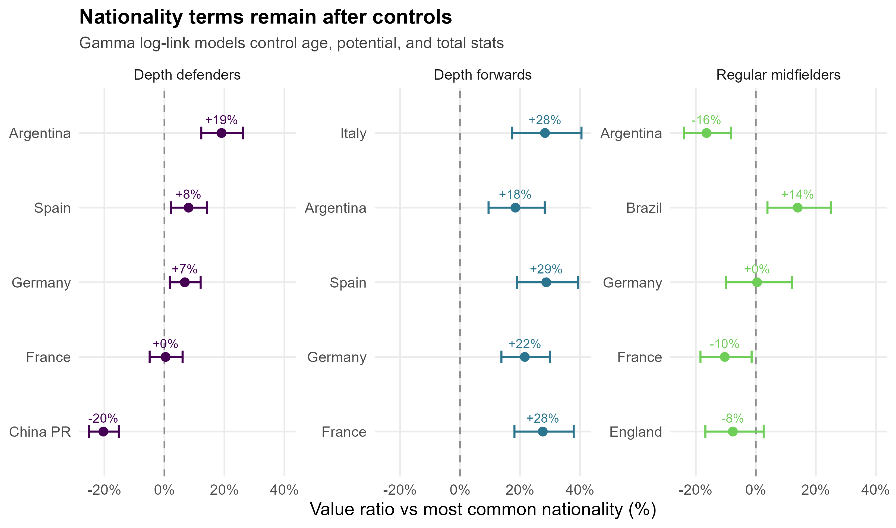
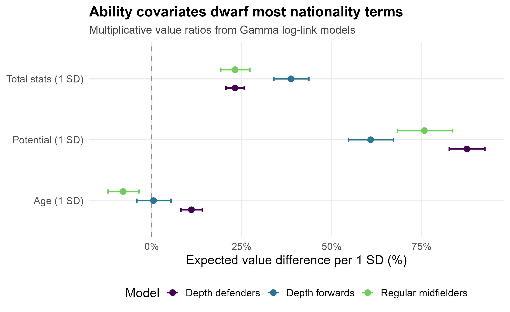
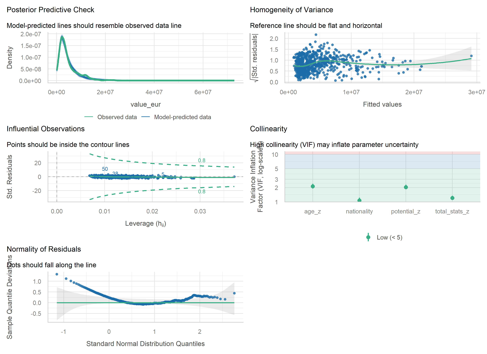

# Analysis: FIFA 23 Players - Nationality and Market Value

## TL;DR
- The usable analysis sample contains 17,426 positive-value FIFA 23 players after excluding 98 zero-value records; market value is extremely right-skewed, so analyses use log scale or Gamma log-link models.
- Within same position and ability tiers, nationality remains associated with market value in large Depth/Youth strata; the Regular midfielder stratum shows weaker rank-test evidence.
- Strongest rank-test evidence appears in Depth/Youth defenders (H = 360.1, p < .001, epsilon-squared = 0.249) and Depth/Youth forwards (H = 103.2, p < .001, epsilon-squared = 0.141).
- The largest model-based nationality terms are local, baseline-dependent estimates and should be presented as sample associations, not causal premiums.
- Age, potential, and total-stat covariates are large value correlates; the strongest poster claim should be about conditional association rather than nationality alone.

## Data
- Source file: `data/FIFA 23 Players.csv`; raw size = 17,524 rows and 95 columns.
- Main variables: `Value(in Euro)` as market value, `Nationality`, `Best Position`, `Overall`, `Potential`, `Age`, and `TotalStats`.
- Data quality: `Value(in Euro)` has no missing values but includes 98 zero values (0.6%); these were excluded before log-scale analysis and Gamma modeling.
- Positive market value remains skewed: median EUR 1M, IQR EUR 500K-EUR 2M.
- The analysis uses specific nationalities within strata; it does not collapse nationality into broad continent or region categories.

## EDA
- Players were stratified by four broad position groups and four ability tiers based on `Overall`: Depth/Youth (<70), Regular (70-77), Starter (78-84), and Elite (85+).
- The most stable local comparisons are in the large Depth/Youth defender/forward strata; Regular midfielders are retained because the README specifically asked for same-position, same-ability local comparisons at more market-relevant ability levels.

## Main analysis
- Method choice: because value is strictly positive after filtering and heavily right-skewed, the main conditional models use Gamma GLM with log link. For unadjusted within-stratum group comparisons, normality and equal-variance assumptions were checked first; violations led to Kruskal-Wallis tests and BH-adjusted Wilcoxon pairwise tests rather than ANOVA.
- Group-comparison assumption checks: Shapiro tests on log value were frequently below .05 and Levene tests indicated unequal variance in some strata, so nonparametric rank tests are the primary group-comparison evidence.
- Depth/Youth (<70) Forward: Kruskal-Wallis H(5) = 103.2, p < .001, epsilon-squared = 0.141.
- Regular (70-77) Midfielder: Kruskal-Wallis H(5) = 10.8, p = 0.056, epsilon-squared = 0.009.
- Depth/Youth (<70) Defender: Kruskal-Wallis H(5) = 360.1, p < .001, epsilon-squared = 0.249.

- Bootstrap median intervals show the scale of the observed gaps in euros:
- Depth/Youth (<70) Defender: Argentina (median EUR 1M, 95% CI EUR 1M-EUR 1.2M); Spain (median EUR 950K, 95% CI EUR 875K-EUR 1.0M); France (median EUR 775K, 95% CI EUR 700K-EUR 925K)
- Depth/Youth (<70) Forward: Spain (median EUR 1M, 95% CI EUR 975K-EUR 1.3M); France (median EUR 950K, 95% CI EUR 800K-EUR 1.2M); Argentina (median EUR 900K, 95% CI EUR 775K-EUR 1.1M)
- Regular (70-77) Midfielder: England (median EUR 4.20M, 95% CI EUR 3.05M-EUR 5.5M); Spain (median EUR 3.60M, 95% CI EUR 3.40M-EUR 4.2M); France (median EUR 3.50M, 95% CI EUR 3.10M-EUR 3.8M)

### Gamma log-link models
- Models were fitted separately within selected homogeneous strata: Regular midfielders, Depth/Youth defenders, and Depth/Youth forwards.
- Each model predicts positive `value_eur` using `nationality + age_z + potential_z + total_stats_z`; coefficients are reported as multiplicative value ratios and converted to percentages.
- Depth/Youth defenders: China PR -20% versus the most common nationality in that stratum (95% CI -25% to -15%).
- Depth/Youth defenders: Argentina +19% versus the most common nationality in that stratum (95% CI +12% to +26%).
- Depth/Youth defenders: Spain +8% versus the most common nationality in that stratum (95% CI +2% to +14%).
- Depth/Youth forwards: Spain +29% versus the most common nationality in that stratum (95% CI +19% to +39%).
- Depth/Youth forwards: Italy +28% versus the most common nationality in that stratum (95% CI +17% to +40%).
- Depth/Youth forwards: France +28% versus the most common nationality in that stratum (95% CI +18% to +38%).
- Regular midfielders: Argentina -16% versus the most common nationality in that stratum (95% CI -24% to -8%).
- Regular midfielders: Brazil +14% versus the most common nationality in that stratum (95% CI +4% to +25%).
- Regular midfielders: France -10% versus the most common nationality in that stratum (95% CI -18% to -1%).

## Diagnostics & robustness
- All `glm()` fits have saved `performance::check_model()` diagnostic figures in `out/figs/`, satisfying the model-diagnostics requirement.
- Collinearity check: maximum VIF across fitted Gamma models is 3.40. This is acceptable for poster-scale interpretation, though `Potential` and `TotalStats` are conceptually related.
- Zero market values were removed before modeling rather than transformed with `log(value + 1)`, because boundary piles can distort residual structure.
- The nonparametric tests and Gamma models agree on the broad pattern: nationality is associated with value within some local strata, but uncertainty remains wide for several specific nationalities.

## Conclusions
- In this FIFA 23 sample, specific nationalities show visible and statistically detectable market-value differences in several same-position, same-ability local strata.
- These results are associations in a cross-sectional observational dataset. They do not show that nationality causes a player to be valued higher or lower.
- A cautious poster wording would be: "Within selected position-ability strata, several nationalities have higher or lower observed market values after accounting for age, potential, and total stats."

Limitations: FIFA market value is an estimated game/database variable, not an observed transfer price. The models do not observe club negotiation context, league visibility, injury history, contract details beyond the available fields, or selection mechanisms behind who appears in the dataset.

## Notes for the team
- The README's goal mentions "nationality effects", but this analysis treats them as conditional associations because there is no randomization or causal identification strategy.
- Broad nationality groupings would obscure the research question, so this analysis keeps specific nationalities and only filters for minimum sample size within strata.
- Some figure subtitles are dense because AGENTS.md requires p-values and effect sizes directly on poster-ready figures.
- The README file appears to have character-encoding damage in this environment, but the field names and intended analysis goal were still recoverable.
