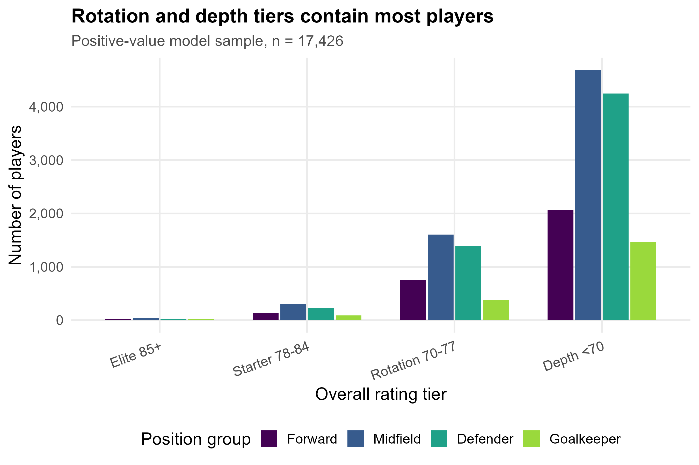
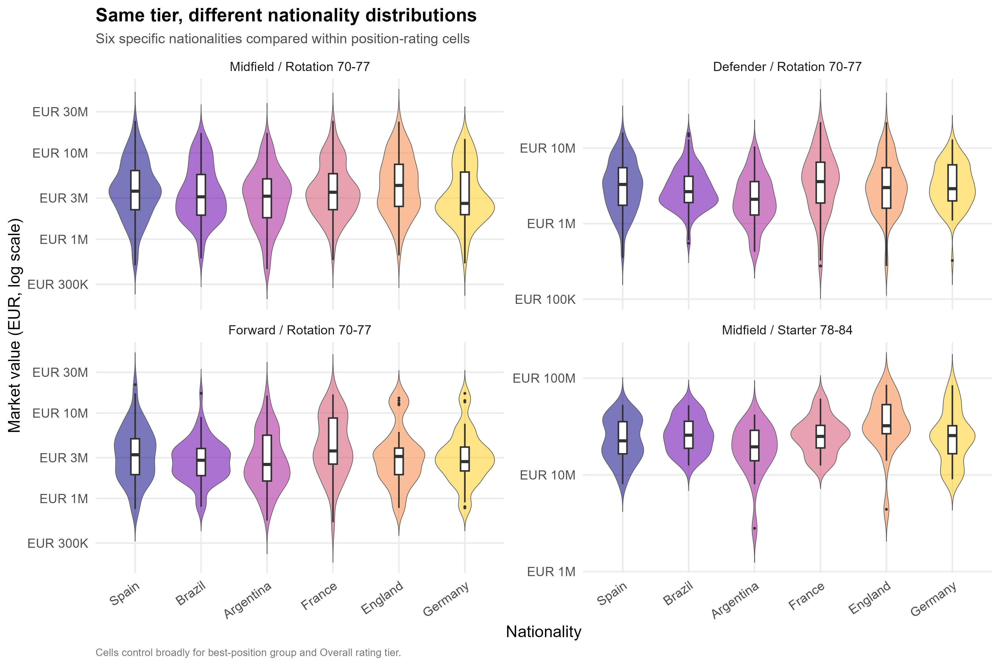
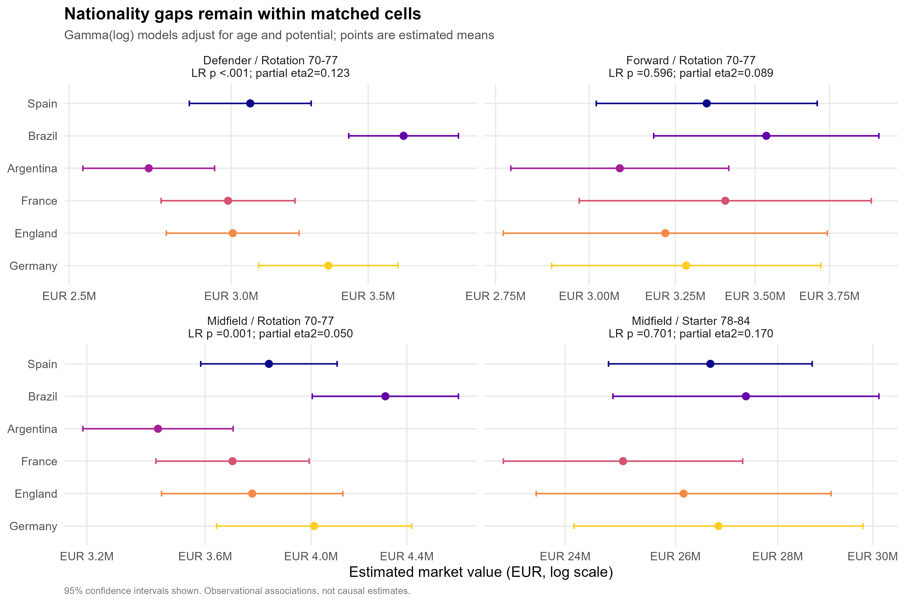
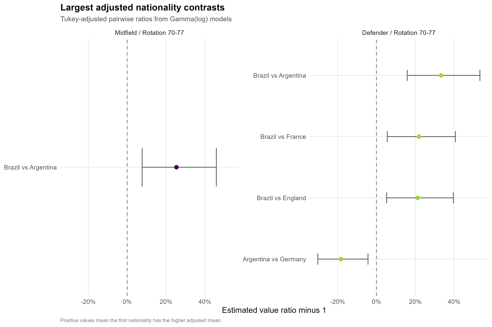
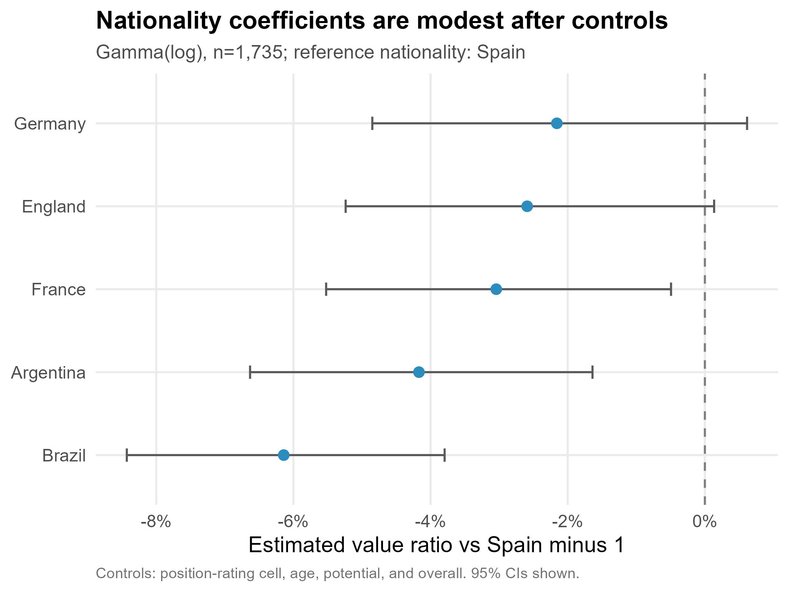

# Analysis: FIFA 23 Players - Nationality and Market Value

## TL;DR
- FIFA 23 market value is extremely right-skewed: median EUR 1.0M, IQR EUR 0.5M-EUR 2.0M, maximum EUR 190.5M; 98 zero-value boundary observations were excluded before modeling.
- After matching broadly on best-position group and Overall tier, nationality differences were clearest among rotation-tier defenders and midfielders, not among rotation-tier forwards or starter-tier midfielders.
- In rotation-tier defenders, Brazil had the highest adjusted mean value (EUR 3.64M [EUR 3.42M, EUR 3.87M]) and was 33% above Argentina after age and potential adjustment.
- In rotation-tier midfielders, Brazil was also highest (EUR 4.31M [EUR 4.00M, EUR 4.63M]) and 25% above Argentina after age and potential adjustment.
- The pooled controlled Gamma model showed small average nationality coefficients versus Spain (about -2% to -6% for the other selected nationalities), so the poster should emphasize cell-specific heterogeneity rather than a single global nationality ranking.

## Data
- Source file: `data/FIFA 23 Players.csv`; raw n = 17,524 rows and 89 columns.
- Model sample: n = 17,426 after excluding 98 players with `Value(in Euro) == 0`; no missing values were found in the model fields used here.
- Nationality is specific country/region text with 157 distinct levels in the full data. To avoid over-broad categories, the main comparisons use six concrete nationalities with adequate cell counts: Spain, Brazil, Argentina, France, England, Germany.
- Position groups were derived from `Best Position`: Forward, Midfield, Defender, Goalkeeper. Ability tiers were based on `Overall`: Elite 85+, Starter 78-84, Rotation 70-77, Depth <70.

## EDA
- Value has a long right tail, so raw-value ANOVA would be a poor default. The analysis uses Gamma GLM with log link for positive market values.
- Most observations sit in the Rotation 70-77 and Depth <70 tiers. Elite cells are too sparse for stable nationality comparisons.
- Selected poster cells: Midfield/Rotation 70-77, Defender/Rotation 70-77, Forward/Rotation 70-77, and Midfield/Starter 78-84. Argentina in Midfield/Starter 78-84 had n=19 and was dropped from the model for that cell; the remaining displayed cells had n >= 20 per nationality except no dropped groups in Forward/Rotation.

## Main Analysis
- Method: within each selected position-rating cell, fit `glm(value_eur ~ nationality + age + potential, family = Gamma(link = "log"))`. This compares multiplicative expected-value ratios while adjusting for age and potential within a local homogeneous cell.
- Hypothesis-test choice: because value is strictly positive after cleaning and strongly right-skewed, Gamma(log) modeling is more aligned with the money-scale question than ordinary ANOVA or rank-only Kruskal-Wallis.

Cell-level likelihood-ratio tests for nationality:
- Midfield / Starter 78-84: LR chi-square(4)=2.19, p = 0.701, partial eta2=0.170.
- Midfield / Rotation 70-77: LR chi-square(5)=20.02, p = 0.001, partial eta2=0.050.
- Defender / Rotation 70-77: LR chi-square(5)=41.80, p < .001, partial eta2=0.123.
- Forward / Rotation 70-77: LR chi-square(5)=3.68, p = 0.596, partial eta2=0.089.

Highest adjusted means in the significant cells:
- In Defender / Rotation 70-77, the highest adjusted mean was Brazil: EUR 3,642,304 [EUR 3,424,145, EUR 3,874,363].
- In Midfield / Rotation 70-77, the highest adjusted mean was Brazil: EUR 4,307,026 [EUR 4,004,869, EUR 4,631,981].

Largest Tukey-adjusted pairwise contrasts:
- Defender / Rotation 70-77: Brazil / Argentina ratio 1.33 [1.16, 1.53], Tukey p < .001 (+33.2%).
- Defender / Rotation 70-77: Brazil / France ratio 1.22 [1.06, 1.41], Tukey p = 0.001 (+21.9%).
- Defender / Rotation 70-77: Brazil / England ratio 1.21 [1.05, 1.40], Tukey p = 0.002 (+21.2%).
- Defender / Rotation 70-77: Argentina / Germany ratio 0.82 [0.70, 0.96], Tukey p = 0.004 (-18.3%).
- Midfield / Rotation 70-77: Brazil / Argentina ratio 1.25 [1.08, 1.46], Tukey p < .001 (+25.4%).

Pooled controlled model, included as a robustness view rather than the main story:
- Gamma(log) model n = 1,735; predictors: cell, nationality, age, potential, overall.
- Brazil vs Spain: ratio 0.939 [0.916, 0.962], p < .001 (-6.1%).
- Argentina vs Spain: ratio 0.958 [0.934, 0.984], p = 0.001 (-4.2%).
- France vs Spain: ratio 0.970 [0.945, 0.995], p = 0.020 (-3.0%).
- England vs Spain: ratio 0.974 [0.948, 1.001], p = 0.062 (-2.6%).
- Germany vs Spain: ratio 0.978 [0.952, 1.006], p = 0.126 (-2.2%).

## Diagnostics & Robustness
- Normality checks on log(value): 4 of 23 nationality-within-cell groups had Shapiro p < .05; group sizes ranged from 20 to 151. This supports avoiding a plain normal-error ANOVA as the primary analysis.
- Levene tests on log(value) by nationality:
- Midfield / Rotation 70-77: Levene p = 0.868.
- Defender / Rotation 70-77: Levene p = 0.004.
- Forward / Rotation 70-77: Levene p = 0.217.
- Midfield / Starter 78-84: Levene p = 0.450.
- Defender/Rotation 70-77 showed unequal log-scale variance, so the significant defender result should be read with the Gamma model and its diagnostics rather than as a classical equal-variance ANOVA result.
- Collinearity in the pooled model was acceptable but not trivial:
- cell: VIF 1.91.
- nationality: VIF 1.16.
- age: VIF 2.75.
- potential: VIF 4.69.
- overall: VIF 3.75.
- Influence check in the pooled Gamma model flagged 0 observations by Cook/outlier criteria; diagnostics were saved for inspection.

Diagnostic figures saved:
- `figs/fig_diagnostics_full_gamma_model.png`
- `figs/fig_diagnostics_gamma_midfield_rotation_70_77.png`
- `figs/fig_diagnostics_gamma_defender_rotation_70_77.png`
- `figs/fig_diagnostics_gamma_forward_rotation_70_77.png`
- `figs/fig_diagnostics_gamma_midfield_starter_78_84.png`

## Conclusions
- In this FIFA 23 sample, nationality-value associations are not uniform. The clearest adjusted gaps appear in rotation-tier defenders and midfielders, where Brazilian players have higher estimated market values than several peer nationalities after controlling for age and potential.
- The evidence is weaker in rotation-tier forwards and starter-tier midfielders; their confidence intervals overlap substantially and the nationality LR tests are not statistically strong.
- These are cross-sectional observational associations. They should not be phrased as nationality causing higher or lower value. Unobserved club context, league exposure, contract details, scouting visibility, and transfer-market liquidity could confound the comparisons.

## Notes for the Team
- Poster-ready figures are in `out/figs/` at 300 dpi. The strongest candidates are `fig_gamma_adjusted_means_by_cell.png`, `fig_top_pairwise_nationality_contrasts.png`, and `fig_eda_value_by_nationality_cells.png`.
- Do not describe this as a universal nationality premium. The pooled model shrinks average differences, while the cell-specific models show where the association is concentrated.
- The README's suggested comparison of broad nationality categories was not followed literally because AGENTS.md warns against over-coarse nationality classification. This analysis compares concrete nationalities with adequate sample sizes.
- Elite-tier cells are too small for credible nationality ranking in this dataset; avoid using star-player anecdotes as statistical evidence.
- All `glm()` calls used for conclusions have accompanying diagnostic PNGs. The diagnostic plots are work products for checking model reliability, not necessarily poster figures.
