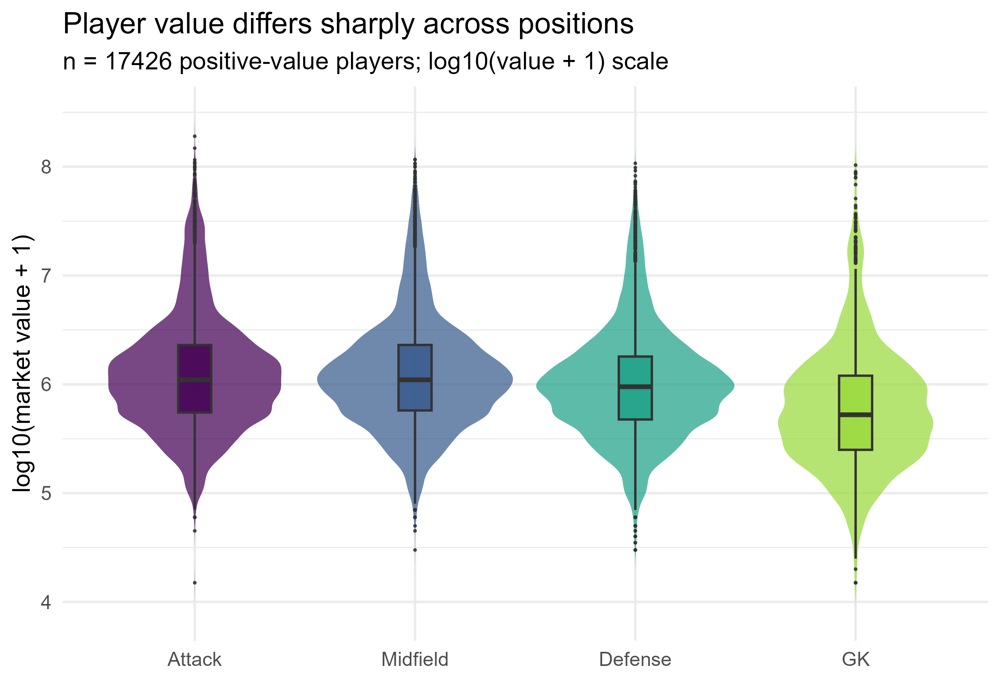
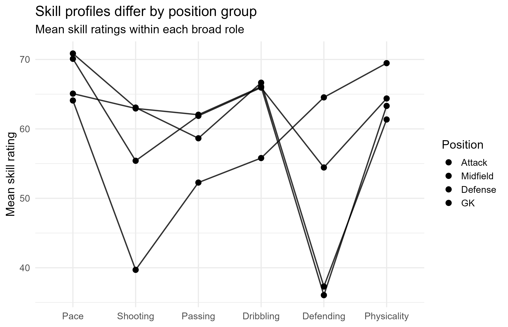
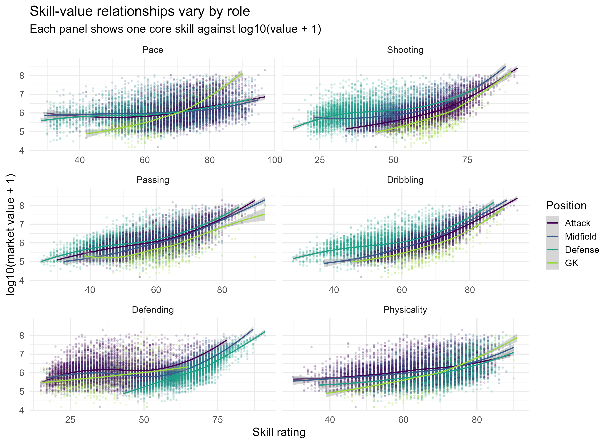
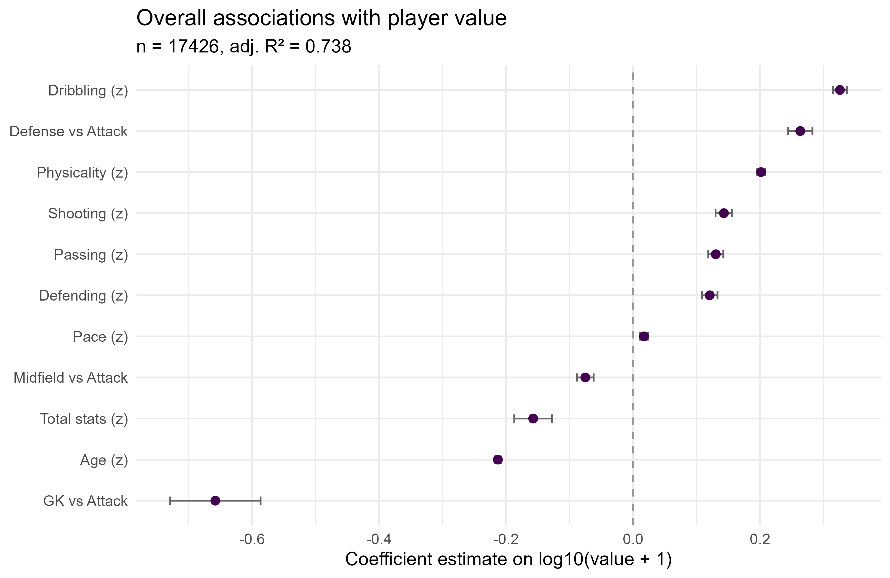
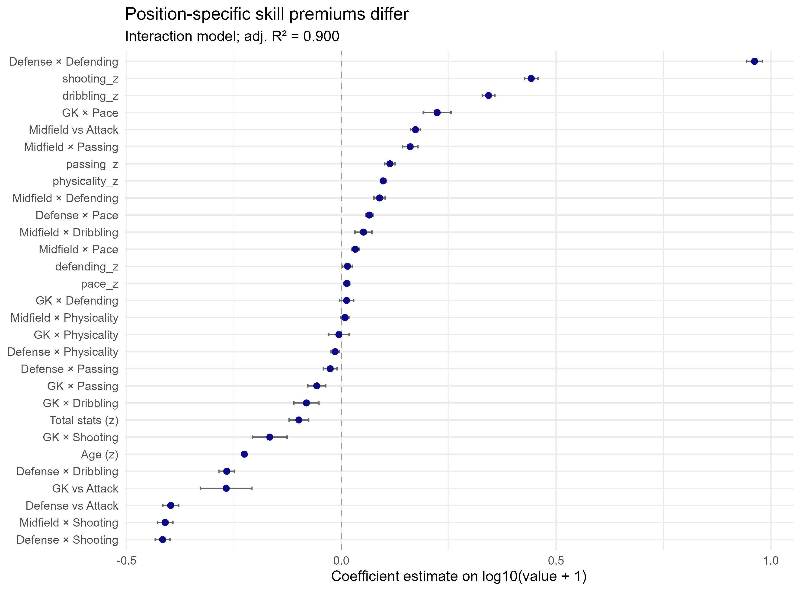
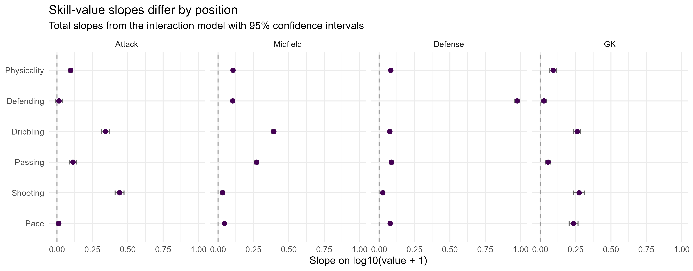
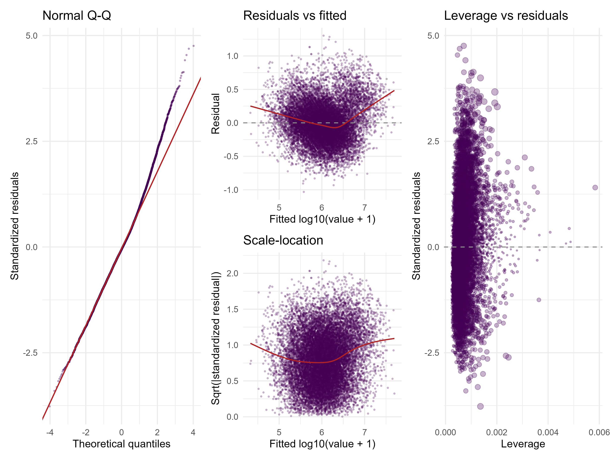
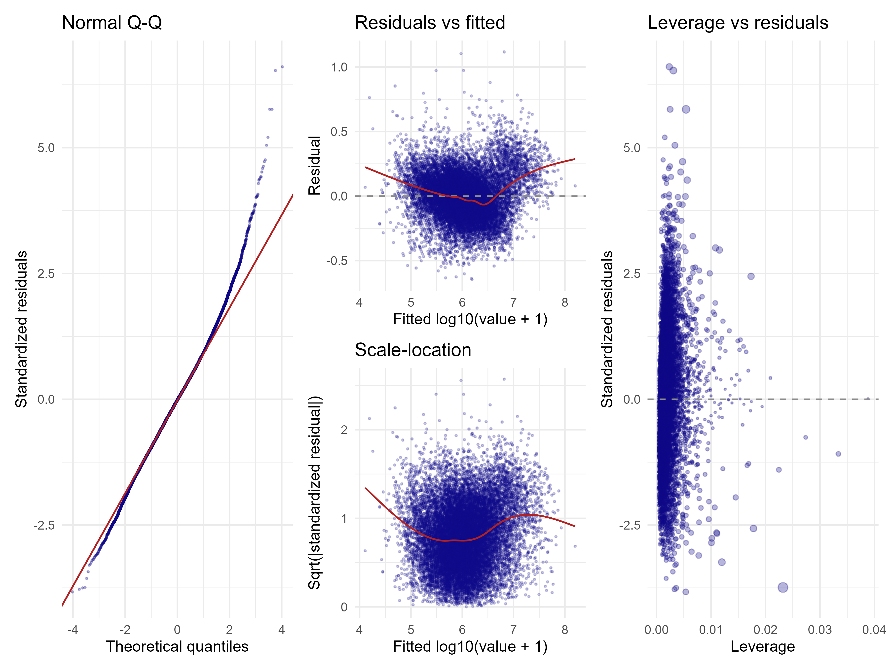
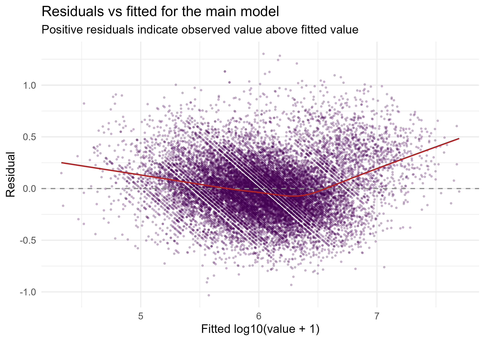
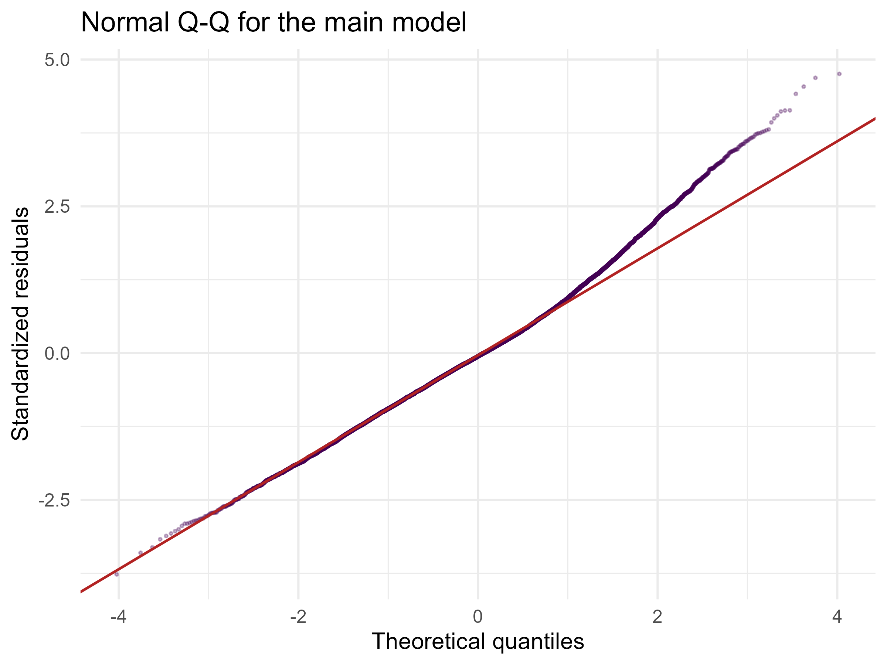

# Analysis: Value_on_Position

## TL;DR
- The analysis retained 17426 players with positive market value and excluded 98 zero-value cases before modeling.
- Market value differed substantially across the four position groups, with Attack players showing the highest median value in this sample.
- The main model explained a meaningful share of variation in log10(value + 1) (adj. R² = 0.738).
- In the main model, Dribbling_z had the strongest association among the six skill variables.
- The interaction model improved fit slightly over the main model (adj. R² = 0.900 vs 0.738), suggesting position-specific skill pricing.
- Skill slopes differed by position; the largest position-specific slope in each role is summarized in the slope figure and table.

## Data
- Rows: 17524; Columns: 113.
- Zero-value players: 98; positive-value players: 17426.
- Missingness was limited in the modeled variables; the key zero inflation issue was the non-trivial set of zero-value players.
- Position groups were Attack, Midfield, Defense, and GK; the 4-group coding matched the project specification.
- Data overview: 

## EDA
- Value was strongly right-skewed, so analysis used log10(value + 1) after excluding zero-value players.
- The four position groups had visibly different value distributions and different mean skill profiles.
- Skill-value scatterplots suggested that no single skill behaved identically across all positions.
- EDA figures:   

## Main analysis
- The main linear model used standardized age, total stats, and the six required skill totals, plus position_group.
- Key main-model coefficients:
- GK vs Attack: β = -0.658, 95% CI [-0.729, -0.587], p = 1.51e-72
- Dribbling (z): β = 0.326, 95% CI [0.315, 0.337], p = 0
- Defense vs Attack: β = 0.263, 95% CI [0.244, 0.283], p = 8.28e-157
- Age (z): β = -0.213, 95% CI [-0.218, -0.208], p = 0
- Physicality (z): β = 0.202, 95% CI [0.196, 0.208], p = 0
- Total stats (z): β = -0.157, 95% CI [-0.187, -0.127], p = 5.54e-25
- The top skill coefficient in the main model was Dribbling (β = 0.326, 95% CI [0.315, 0.337], p = 0).
- Interaction model results were summarized with position-specific slopes rather than raw interaction terms.
- Main model figure: 
- Interaction figure: 
- Position-specific slope figure: 

## Diagnostics & robustness
- Main-model adjusted R² = 0.738; interaction-model adjusted R² = 0.900.
- Maximum VIF in the main model was 111.68; in the interaction model it was 1549.06, so collinearity is substantial and must be interpreted cautiously.
- Diagnostic summary: main max Cook's D = 0.0022; interaction max Cook's D = 0.0111.
- Diagnostic figures:    

## Conclusions
In this sample, player value is associated with both overall quality and specific skill profiles, but the skill-value relationship is not the same in every position group. The broad pattern is that position matters, and the six core skills should not be collapsed into one generic measure if the goal is to describe market pricing by role.

These results are observational associations, not causal effects. Unmeasured factors such as contract structure, league context, injuries, and transfer market conditions may still confound the observed patterns.

## Notes for the team
- The position_group coding produced an empty Other level for this dataset, so the analysis effectively uses the four requested groups only.
- `emmeans` was not available in the environment, so position-specific slopes were computed manually from the fitted interaction model using the full variance-covariance matrix.
- The model still shows notable collinearity because the assignment requires all six core skills to remain in the specification; this is a feature of the design, not a coding bug.
- If space is tight on the poster, prioritize the position-value violin plot, the main coefficient plot, and the position-specific slope figure.
